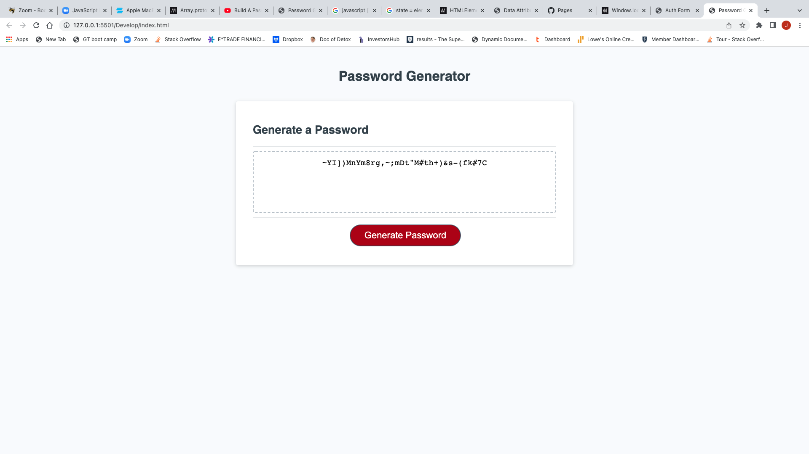

# Javascript-password

## Description

 A random secure password needs to be generated that meets the following criteria to provide greater security.
 Give a series of prompts, which include the length of characters between 8 & 128, whether to include lowercase, uppercase, numeric, and/or symbols.  When the prompts are selected, a password should be generated that matches the selected criteria.  This password needs to be displayed or written to the page.  
 In Javascript I created variables, character codes from low to high, and variables for characters.  Then a function was created for choosing character selections, and a function to write the password that was generated, along with a for loop to generate the random password each time. 

 URL: 
 GitHub Link: https://github.com/jsouth75/javascript-password

 
 